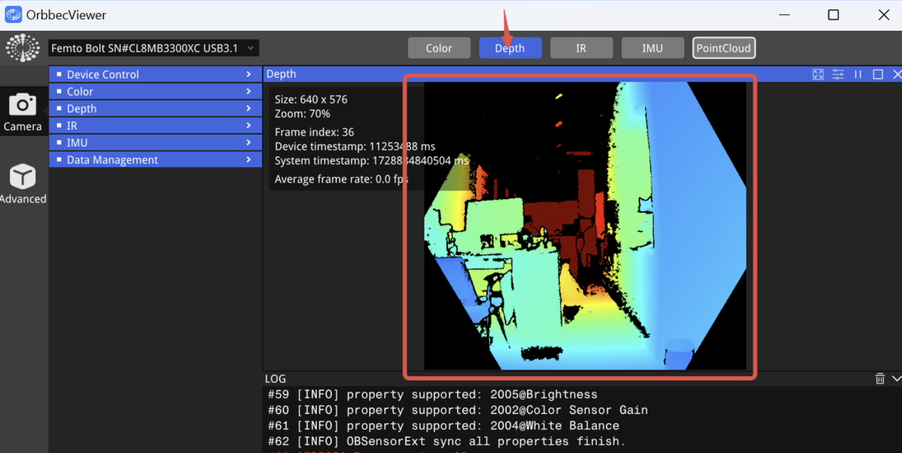
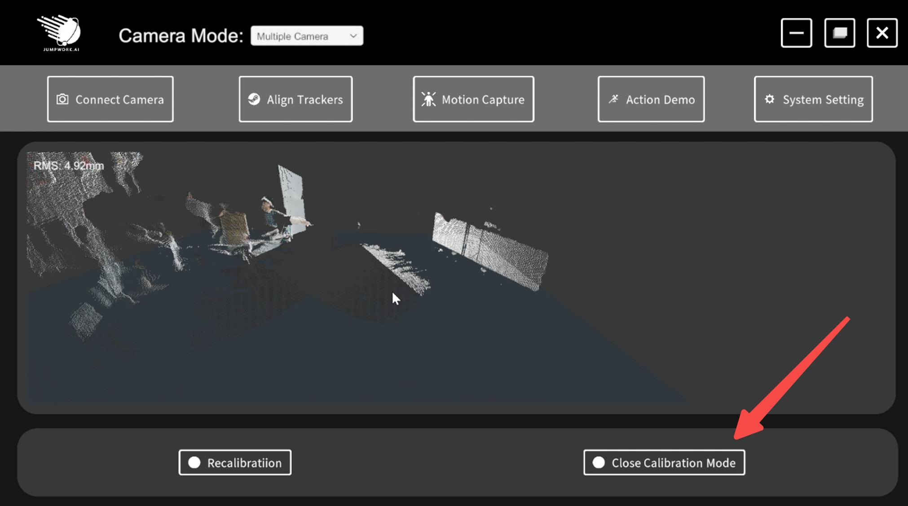

# Login

Use Steam's one-click login; before logging in, you must check the box to agree to the Terms of Service and Privacy Policy

# Check the camera connection

If this is your first time using the device, please check whether the camera is functioning properly.

- First, unzip the software folder, then open OrbbecViewer.

Check if the connection is via a USB 3.0 port or higher.

Click on "Depth." If the depth map is displayed correctly, the camera is functioning properly.

# Connect Camera

First, select either single-camera mode or dual-camera mode based on the number of cameras you are using. The default mode is single-camera mode.

## Single-camera

The camera comes with two types of cables: a power cable and a data cable. Please connect the USB end of the data cable to a USB 3.0 port on your computer.

There are two ways to connect the camera:

- Manual connection: If the camera's cables were not connected before launching the software, you will need to manually click "Connect" after connecting the camera.

- Automatic connection. You need to check "Auto-connect on startup." If the camera cables are connected before starting the software, it will automatically detect and connect the camera.
  

## Double-camera

### **Installation and Placement**

The camera comes with two types of cables: a power cable and a data cable. Please connect the USB end of the data cable to a USB 3.0 port on your computer.

The cameras are suitable for a square room ranging from 2x2 meters to 8x8 meters, with corresponding diagonal distances of approximately 2.82 meters to 11.3 meters.

If the room is smaller, the cameras can be placed at half the height of a person or mounted on the wall with a downward tilt.

### Connect

Before using dual cameras, you need to switch to Multiple-Camera mode.

When using dual cameras for the first time, please perform the calibration process. Place the calibration sheet between the two cameras. Once the progress bar reaches 100%, the calibration is complete.

**Note! When calibrating, please hold the blank area of the calibration sheet.**

【The A4 calibration paper file can be found in the root directory of the installation path: ：\Printingthis\A4.PDF，Please use double-sided printing to ensure that the patterns on both sides are perfectly aligned after printing.】

After the calibration is complete, the point cloud view of the cameras will be displayed. 

You can check for any calibration errors. If errors are found, you can recalibrate. If everything is correct, you can close the calibration.

There are two ways to connect the camera:

- Manual connection: If the camera's cables were not connected before launching the software, you will need to manually click "Connect" after connecting the camera.

- Automatic connection.：If the camera's cables are fully connected before launching the software, the software will automatically detect and connect to the camera.
  

# Align Trackers
Once the camera is successfully connected, the software will automatically navigate to the node alignment interface.

There are two alignment methods:

- Raise your left hand in VR and use the controller's ray to click the "Align" button on the raised-hand panel.

- Click the "Align" button in the software to perform the alignment.

After entering the alignment mode, immediately assume an A-Pose and hold the position, then pull the trigger on the controller.

Look down to observe the skeletal position; if the skeletal position is correct, the alignment is successful.

## HUD display

When the raise hand display window is closed in VR, you can reopen it using the software's button. If the toggle button is green, it indicates that it is open; if the toggle button is gray, it indicates that it is closed.

# Motion Capture

- For motion capture, first import the FBX model.
  - The FBX model's skeleton must meet the same requirements as outlined on [help.wonderdynamics.com](https://help.wonderdynamics.com/character-creation/ai-mocap-system/markerless-motion-capture/bone-mapping-distribution-and-tpose).
  - After clicking "Start Recording," the FBX model will begin to follow your movements. When you click "Stop Recording," the FBX model will stop following.
  - Click the "Export" button, choose the directory where you want to save the BVH file, and then save the file.

- Open the imported BVH format video using Blender,File--Import--Motion Capture(.bvh).

# Action Demo

- After the camera is connected, you can preview your movements. The distance between you and the camera should be approximately 1.5 meters.
- Motion Capture Pars: Displays parameters for motion preview, status, frame rate, and latency, among other details.
- Click the "Motion Capture Setting" button to toggle the preview on or off.

# System Setting

1. **Select Language**:  You can choose between English and Simplified Chinese, with English being the default.
2. **OtherSetting**: Click **"Auto-connect camera on Startup"**, and the camera will automatically connect the next time you log in.
3. **Tracking Mode Select**: You can choose between full-body tracking and half-body tracking.
4. **Help**: For more information, you can visit the official JUMPWORK website；
       If you have any questions about using the software, you can click on “**Help Website**”.
4. **Help**: For more information, you can visit the official JUMPWORK website.

# After-Sales Contact

Our after-sales email is:  aftersales@jumpworker.com

If you have any questions, feel free to contact us!

